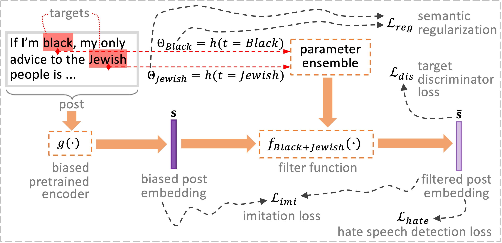

I am a PhD student at The University of Queensland (UQ), Australia, specialising in robust and trustworthy graph machine learning. My research is conducted under the supervision of Dr. Ruihong Qiu,  A/Prof. Guangdong Bai, and Prof. Zi (Helen) Huang. In 2023, I completed my dual Bachelor of Computer Science and Master of Data Science degrees at UQ, graduating as the class of 2023 Valedictorian.

Publications
======
<table style="width:100%;border:0px;border-spacing:0px;border-collapse:separate;margin-right:auto;margin-left:auto;font-size:1em;"><tbody>
          <tr>
            <td style="padding:0 12px 0 0;width:25%;vertical-align:middle">
              
            </td>
            <td width="75%" valign="middle">
              <strong>GOLD: Graph Out-of-Distribution Detection via Implicit Adversarial Latent Generation</strong>
               
              <strong>Danny Wang</strong>, Ruihong Qiu, Guangdong Bai, Zi Huang
               
              ICLR 2025 (<strong>Spotlight</strong>)
               
              <a href="https://arxiv.org/abs/2502.05780" target="_blank">Paper</a> /
              <a href="https://github.com/DannyW618/GOLD" target="_blank">Code</a>
              

              

              

                We propose the GOLD framework for graph OOD detection, an implicit adversarial learning pipeline with synthetic OOD exposure without pre-trained models.
              

            </td>
          </tr>
</tbody>
</table>

<table style="width:100%;border:0px;border-spacing:0px;border-collapse:separate;margin-right:auto;margin-left:auto;font-size:1em;"><tbody>
          <tr>
            <td style="padding:0 12px 0 0;width:25%;vertical-align:middle">
              
            </td>
            <td width="75%" valign="middle">
              <strong>Hate Speech Detection with Generalizable Target-aware Fairness</strong>
               
              Tong Chen, <strong>Danny Wang</strong>, Xurong Liang, Marten Risius, Gianluca Demartini, Hongzhi Yin
               
              KDD 2024
               
              <a href="https://dl.acm.org/doi/abs/10.1145/3637528.3671821" target="_blank">Paper</a> /
              <a href="https://github.com/xurong-liang/GetFair" target="_blank">Code</a>
              

              

              

                We propose the GetFair framework, a novel approach for equitably detecting hate speech across diverse targets, including those unseen during training. This framework ensures fair detection with consideration of the social groups targeted in the content.
              

            </td>
          </tr>
</tbody>
</table>

Teaching Experience
===

- 2024, 2025, Tutor for master of Data Science Capstone Project (DATA7901/DATA7903)
- 2024, 2025, Tutor for undergraduate & postgraduate level course INFS4205/7205 Advanced Techniques for High Dimensional Data
- 2022, Tutor for postgraduate level course DATA7001 Introduction to Data Science

Education
===

- 01/2024 - 12/2027, **Doctor of Philosophy (PhD) in CS** , The University of Queensland
- 02/2020 - 12/2023, **Bachelor of Computer Science/ Master of Data Science** , The University of Queensland, **GPA Rank 1st**

Awards
===
- 12/2023, Valedictorian, I was selected as the **class of 2023 Valedictorian** for the graduation ceremony of the Faculty of Engineering, Architecture and Information Technology
- 2020, 2021, 2022, 2023 -- **Dean’s Commendation for Academic Excellence**. The Faculty of Engineering, Architecture and Information Technology, has determined that students who demonstrate excellence in academic performance should receive acknowledgement of the achievement.
  
